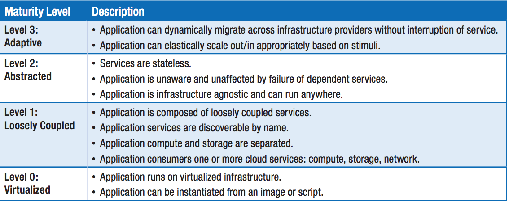

## Commodity cloud first

To take full advantage of cloud capabilities, you should design your application architecture taking into account cloud characteristics such as elasticity, self-service, and multi-tenancy. You will also need to understand the best practices for and constraints of distributed systems. You should also consider using provided SaaS such as AWS S3 and SES.

### Cloud native maturity model

Below is a diagram showing cloud native maturity. You should strive at least for level 2.

* Level 1 - Loosely coupled - the application is separated from the data storage tiers, network constructs, config and logs.
* Level 2 - Abstracted - the application is fully decoupled from the infrastructure, with abstracted deployment and scaling policies. Must be elastically scalable, resilient and avoid cascading failures.
* Level 3 - Adapted -  the application is able to detect or anticipate changes and react to them in a fully automated manner

### References and further reading

[Cloud native application security model](http://www.nirmata.com/2015/03/cloud-native-application-maturity-model/)

